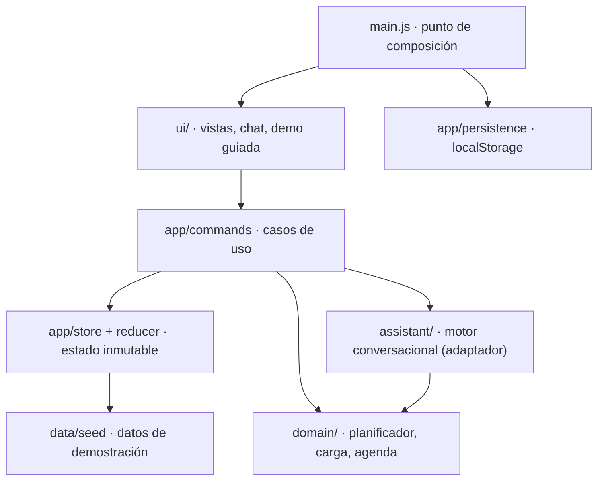

# MindOS

**Asistente académico que detecta cuándo tu semana deja de ser viable y la reorganiza contigo, desde WhatsApp.**

MindOS junta en un solo plan las clases, entregas, reuniones y turnos de trabajo que hoy viven repartidos entre Google Classroom, Microsoft Teams, Asana, Notion y el calendario personal. Con esa vista completa hace algo que ninguna de esas plataformas puede hacer por separado: calcula si el tiempo real alcanza, avisa cuando un cambio rompe el plan y propone la reorganización que menos altera la semana, sin tocar las horas de sueño.

- **Demo en vivo:** https://ddamianzr.github.io/mindos-propuesta-ads/
- **Proyecto:** propuesta para Análisis y Diseño de Sistemas, Instituto Politécnico Nacional.

---

## El problema

Un estudiante de ingeniería lleva cuatro o cinco materias y cada profesor elige su plataforma: uno publica en Classroom, otro en Teams, el equipo del proyecto se organiza en Asana y el horario de trabajo está en Google Calendar. Cada herramienta muestra bien lo suyo, pero ninguna ve la semana completa.

Eso provoca fallas concretas:

- **Choques invisibles.** Si un profesor adelanta un examen en Teams, nada lo relaciona con las dos entregas de Classroom de ese mismo día ni con el turno de trabajo del estudiante.
- **Planes que no caben.** Saber *qué* hay que entregar no dice *cuándo* hacerlo. La carga real se descubre la noche anterior.
- **Costo de revisar todo.** Abrir cinco aplicaciones para armar el panorama se vuelve un hábito que se abandona.
- **El sueño paga la diferencia.** Cuando el plan no alcanza, lo primero que se sacrifica es dormir.

## La solución

MindOS funciona en tres pasos:

1. **Unifica.** Normaliza pendientes y compromisos de todas las fuentes en un mismo modelo: fecha límite, materia, esfuerzo estimado y avance.
2. **Planea con límites reales.** Reparte bloques de estudio entre clases y turnos, respeta un límite diario de enfoque y nunca agenda después de la hora de corte previa a dormir.
3. **Vigila y propone.** Cuando una fuente cambia, recalcula la carga, detecta conflictos y propone el cambio mínimo. El estudiante decide si lo aplica, desde la app o respondiendo en WhatsApp.

El canal principal es **WhatsApp**, porque es donde el estudiante ya está: ahí recibe el resumen del día, las alertas y puede preguntar en lenguaje natural.

## Propuesta de valor

| Para el estudiante | Por qué es distinto |
| --- | --- |
| Sabe cada mañana qué hacer y cuándo | El plan se calcula con clases, trabajo y límites de enfoque reales, no es una lista de pendientes |
| Se entera de un choque antes de que sea urgente | Cruza información de plataformas que no se hablan entre sí |
| Decide con una propuesta concreta | MindOS muestra qué se mueve, a dónde y con qué efecto; nada cambia sin confirmación |
| Protege su descanso | La hora de dormir es una restricción del planificador, no un consejo |
| No instala otra app | Todo funciona también por WhatsApp |

---

## Qué incluye la demo

| Sección | Qué muestra |
| --- | --- |
| **Hoy** | Qué sigue ahora, agenda del día con clases y bloques de estudio, estudio planeado frente al límite de enfoque y próximas entregas |
| **Semana** | Radar de carga por día (trabajo contra enfoque disponible), alertas de conflicto, propuesta de reorganización con antes y después, y sueño de la semana |
| **Pendientes** | Bandeja unificada agrupada por urgencia, filtros por plataforma, estado del plan de cada tarea y marcar como terminada con opción de deshacer |
| **Fuentes** | Plataformas conectadas con permisos de solo lectura, sincronización, error y reautorización de una fuente, y actividad reciente |
| **Asistente (WhatsApp)** | Resumen matutino, preguntas en texto libre, respuestas rápidas, alertas proactivas y confirmación de cambios |
| **Demo guiada** | Seis pasos con guion para presentar el producto en 3 a 5 minutos |

Otros detalles:

- **Coherencia entre canales.** La app y el chat leen el mismo estado: lo que se aplica en uno aparece al instante en el otro.
- **Temas y dispositivos.** Hay modo claro y oscuro y funciona en móvil, tablet y escritorio.
- **Persistencia y reinicio.** El estado se guarda en el navegador y se puede reiniciar la demo en cualquier momento.

### Qué es real y qué está simulado

| Implementado y funcionando | Simulado para la demo |
| --- | --- |
| Planificador de bloques y detección de conflictos | Conexión con Classroom, Teams, Asana, Notion y demás: los datos vienen de `src/data/seed.js` |
| Propuesta de reorganización con cambios mínimos | La sincronización revela un cambio preparado: el quiz adelantado |
| Motor conversacional en español basado en intenciones | WhatsApp: es una vista previa dentro del navegador, sin API de Meta |
| Estado, persistencia local, deshacer y reinicio | El reloj: la demo empieza el lunes a las 06:50 de la semana actual |
| Accesibilidad, diseño adaptable y modo oscuro | El registro de sueño |

---

## Cómo presentar la demo (3 a 5 minutos)

Pulsa **Demo guiada** en la barra superior. Reinicia los datos y recorre la historia:

| Paso | Vista | Qué pasa | Qué decir |
| --- | --- | --- | --- |
| 1 | Fuentes | Ocho plataformas, una con error | «Cada profesor publica en un lugar distinto. Ninguna plataforma ve la semana completa.» |
| 2 | Pendientes | Bandeja unificada | «MindOS junta todo, con fecha, tiempo restante y plan.» |
| 3 | Hoy + WhatsApp | Se pregunta «¿Qué tengo hoy?» | «Valeria no abre otra app: pregunta por WhatsApp.» |
| 4 | Semana | Teams adelanta el quiz; el miércoles pasa a sobrecarga y llega la alerta | «Este es el choque que nadie más detecta.» |
| 5 | Semana | Aparece la propuesta: un cambio, conflictos resueltos | «Mueve lo mínimo y no toca el sueño. Ella decide.» |
| 6 | Semana | Se aplica; radar y WhatsApp se actualizan | «Siguiente: horario desde SAES, modo equipo y alertas para tutores.» |

Después del recorrido conviene escribir en el chat algo como «ya terminé el reporte de VLSM» o «¿cómo va mi semana?» para mostrar que responde con los datos del momento.

---

## Arquitectura

La lógica del producto vive en funciones puras, sin DOM ni almacenamiento, y la interfaz se construye encima. Cada capa depende solo de las de abajo.



| Capa | Responsabilidad | Depende de |
| --- | --- | --- |
| `domain/` | Tiempo, disponibilidad, tareas, agenda, radar de carga y planificador. Funciones puras. | Nada |
| `shared/` | Formato en español y frases compartidas por la app y WhatsApp | `domain/` |
| `assistant/` | Intenciones y respuestas. Devuelve mensajes, acciones y efectos como datos. | `domain/`, `shared/` |
| `app/` | Store, reducer, persistencia y comandos que orquestan los tiempos de cada acción | `domain/`, `data/` |
| `ui/` | Renderizado, navegación, accesibilidad y microinteracciones | `app/` (solo comandos), `domain/` para lectura |
| `main.js` | Elige las implementaciones concretas y las conecta | Todo |

### Decisiones técnicas

- **HTML, CSS y JavaScript con módulos ES, sin framework ni build.** El proyecto original era estático. Mantener ese stack permite publicarlo en GitHub Pages tal cual, abrirlo sin instalar dependencias y probar el dominio con el runner nativo de Node. El costo es que en local necesita un servidor HTTP, porque los módulos no cargan desde `file://`.
- **Minutos de semana en lugar de objetos `Date`.** El dominio representa cada momento como minutos desde el lunes 00:00. Se compara con enteros, no hay errores de zona horaria y los tests son deterministas. `Date` solo se usa para mostrar fechas.
- **Fechas relativas a la semana actual.** La demo nunca muestra fechas vencidas ni días de la semana equivocados, un problema que tenía la versión anterior.
- **Planificador con estabilidad.** Prioriza la fecha límite más cercana (*earliest deadline first*), conserva los bloques válidos, evita ocupar huecos de otras tareas y solo excede el límite de enfoque con tope y como último recurso. La ventana de sueño nunca se rompe. Así, un cambio produce una propuesta pequeña y explicable, no un plan nuevo.
- **La interfaz no despacha acciones.** Solo llama a comandos (`app/commands.js`). Los comandos aplican los tiempos visibles (escribir, sincronizar, analizar) y descartan trabajo pendiente si la demo se reinicia, lo que evita la condición de carrera que tenía la versión anterior.
- **El asistente es un adaptador.** `ruleBasedAssistant` implementa `respond`, `briefing`, `syncReport` y `appliedNotice`. Un motor con LLM puede implementar la misma interfaz usando las funciones de dominio como herramientas (function calling), sin cambiar la interfaz ni el store.
- **Restricciones reales del canal.** Las respuestas rápidas respetan los límites de WhatsApp: máximo 3 botones y 20 caracteres por botón. Hay un test que lo verifica.
- **Seguridad básica.** Ningún texto del usuario pasa por `innerHTML`: se construye con nodos de texto y el formato de WhatsApp (`*negritas*`) se interpreta de forma segura. La persistencia tolera almacenamiento lleno, bloqueado o corrupto.

---

## Design system

**Neumorfismo sobrio, con reglas de accesibilidad.** Una sola superficie de la que los elementos se elevan o se hunden, y cada estado tiene un significado:

| Tratamiento | Significado | Ejemplos |
| --- | --- | --- |
| Elevado | Se puede tocar o contiene elementos | Botones, tarjetas, bloques de estudio |
| Hundido | Datos o entradas que no se mueven | Campos, medidores, clases y turnos fijos |
| Presionado | Seleccionado o activo | Pestaña actual, día elegido en el radar |
| Relleno de color | Acción principal | «Aplicar cambios», «Reorganizar semana» |

- **Color con función.**
  - **Teal** (`#0b6e71`) marca la identidad de la app, las acciones y lo que planea MindOS.
  - **Ámbar** indica un día *justo* y **coral**, *sobrecarga*.
  - Cuatro tonos identifican materias, siempre acompañados de texto.
  - Los tokens están en `styles/tokens.css`, con modo oscuro completo.
- **Contraste verificado.** Todos los pares de texto cumplen WCAG AA en ambos temas. Las sombras son un poco más marcadas de lo habitual para que no desaparezcan en un proyector.
- **Tipografía.** [Lexend](https://www.lexend.com/), una familia diseñada para reducir el esfuerzo de lectura, en una sola familia con escala 12 · 14 · 16 · 18 · 21 · 24 · 36 px.
- **Movimiento.** Transiciones de 120 a 420 ms que solo responden a acciones: presionar, confirmar o reorganizar, cuando el radar anima únicamente los días que cambiaron. Se respeta `prefers-reduced-motion`.
- **Accesibilidad.**
  - Landmarks y jerarquía de encabezados.
  - Foco visible y gestionado al cambiar de vista.
  - Chat como región `log` y avisos en una región `status`.
  - Nombres accesibles que incluyen el texto visible.
  - Objetivos táctiles de al menos 44 px.
  - Lighthouse: 100 en accesibilidad, buenas prácticas y SEO, en escritorio y en móvil.

---

## Stack

| Área | Tecnología |
| --- | --- |
| Interfaz | HTML5, CSS con custom properties, JavaScript (ES2022, módulos nativos) |
| Pruebas | `node:test` y `node:assert` (incluidos en Node) |
| Servidor local | `scripts/serve.mjs` (sin dependencias) |
| Publicación | GitHub Pages |
| Dependencias de ejecución | Ninguna (solo la fuente Lexend desde Google Fonts, con respaldo del sistema) |

## Estructura del proyecto

```
.
├── index.html              Documento base: landmarks, navegación y arranque sin destellos
├── assets/favicon.svg
├── styles/
│   ├── tokens.css          Design tokens (color, tipografía, espacio, sombras, movimiento)
│   ├── components.css      Botones, tarjetas, controles, avisos, estados vacíos
│   └── app.css             Estructura, vistas, canal de WhatsApp, demo guiada y breakpoints
├── src/
│   ├── main.js             Punto de composición
│   ├── domain/             time, calendar, tasks, agenda, workload, planner
│   ├── shared/             format (español), copy (frases compartidas)
│   ├── assistant/          intents (comprensión), engine (respuestas)
│   ├── app/                store, reducer, commands, persistence
│   ├── data/seed.js        La semana de Valeria
│   └── ui/                 shell, chat, tour, components, dom, icons y views/
├── tests/                  Dominio, asistente, formato e historia completa de la demo
├── scripts/
│   ├── serve.mjs           Servidor estático para desarrollo
│   └── check.mjs           Verificaciones estáticas y reglas del proyecto
└── package.json            Scripts, sin dependencias
```

## Instalación y ejecución

Requisito: [Node.js](https://nodejs.org/) 20 o superior.

```bash
git clone https://github.com/DDamianZR/mindos-propuesta-ads.git
cd mindos-propuesta-ads
npm start
```

Después abre http://localhost:5173. No hay dependencias que instalar.

Sin Node, cualquier servidor estático funciona, por ejemplo:

```bash
python -m http.server 5173
```

### Pruebas y verificación

```bash
npm test
```

```bash
npm run check
```

`npm run check` revisa la sintaxis de todos los scripts, que cada módulo de `src/` resuelva sus importaciones y tres reglas del proyecto:

- no usar `innerHTML` con datos;
- no dejar `console.log`;
- no usar colores literales fuera de `styles/tokens.css`.

Las pruebas cubren:

- **Planificador:** ventana de sueño, compromisos, fechas límite, prioridad, estabilidad y extensión con tope.
- **Radar de carga.**
- **Comprensión de mensajes** y límites de WhatsApp.
- **Formato en español.**
- **Contrato de la demo:** la historia completa, deshacer, persistencia y la condición de carrera al reiniciar.

### Personalizar la demo

Todo el contenido está en `src/data/seed.js`: perfil (nombre, límites de enfoque, hora de dormir), materias, horario, pendientes, fuentes y el cambio que aparece al sincronizar. Si cambias la forma de los datos, aumenta `SCHEMA_VERSION` para descartar sesiones guardadas antiguas.

---

## Roadmap

| Etapa | Qué agrega | Por qué |
| --- | --- | --- |
| **1. Integraciones reales** | OAuth 2.0 de solo lectura con Google Classroom (`courseWork`), Microsoft Graph (tareas de Education) y Google Calendar | Reemplaza los datos simulados sin cambiar el dominio |
| **2. Canal real** | WhatsApp Business Platform (Cloud API), webhooks y plantillas aprobadas para avisos fuera de la ventana de 24 horas | El asistente llega al teléfono del estudiante |
| **3. Backend** | API, base de datos, sincronización periódica en segundo plano, multiusuario y zonas horarias | Persistencia y avisos sin el navegador abierto |
| **4. Motor con LLM** | Mismo contrato del asistente, con las funciones de dominio como herramientas y confirmación obligatoria antes de cambiar el plan | Conversación más flexible sin perder control |
| **5. Aprender del estudiante** | Comparar el tiempo estimado con el real y ajustar estimaciones y límites | Planes más precisos cada semana |
| **6. SAES y modo equipo** | Importar horario y calificaciones; tareas compartidas del proyecto con responsables | Menos captura manual y coordinación del equipo |
| **7. Tutores** | Alertas tempranas de sobrecarga sostenida, con consentimiento del estudiante | Prevenir rezago antes de que sea tarde |

## Contexto académico

Proyecto de la materia Análisis y Diseño de Sistemas (IPN, 2026). La propuesta aplica levantamiento de requerimientos centrado en el usuario, modelado del dominio, diseño de interfaces accesibles y una arquitectura por capas preparada para sustituir cada parte simulada por su versión real.
